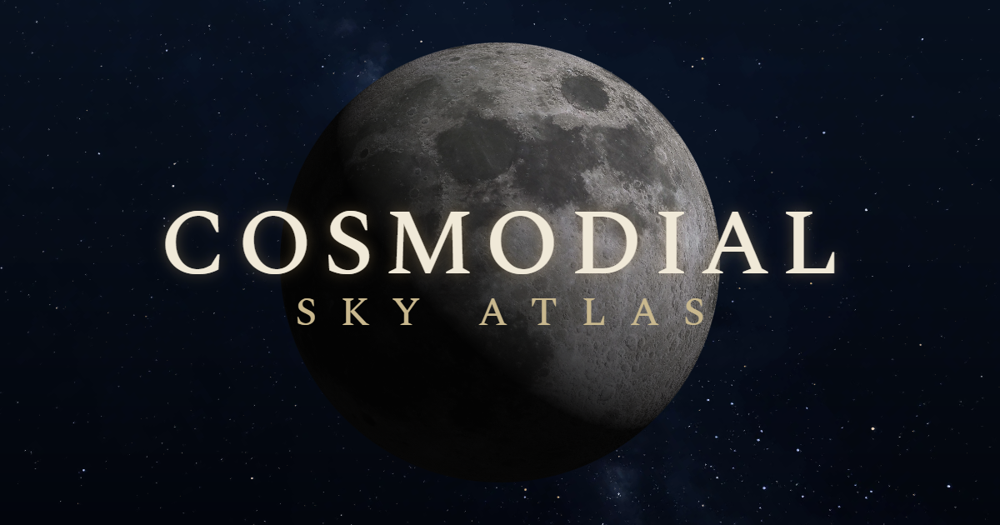

# 🔭🌌 Cosmodial Sky Atlas

**The whole night sky, in your browser. No app store, no signup, no clouds.**

## [✨ Open Cosmodial →](https://killedbyapixel.github.io/Cosmodial/)

Ever look up and wonder *"wait, is that a planet or just a really bright star?"*

Cosmodial knows. Tell it where you are and it paints the actual sky above your head, live! The Milky Way drifting overhead, the horizon glowing at dusk, planets show up exactly where they really are. Drag to look around, zoom from a wide view all the way down to a telescopic eyepiece view where Saturn's rings resolve.

## What you can do

🧭 **Just look up.** Set your location and the sky matches reality. Point your phone at the sky and the view follows.

⏰ **Bend time.** Scrub forward or backward by minutes or centuries.

🔍 **Find anything.** Search for a name and fly straight to it. Tap any object for details.

⭐ **Keep favorites.** Star the objects you love and jump back with one click.

🪐 **See the solar system for real.** Everything is shown at true scale, from Jupiter's moons to Saturn's rings.

🌅 **Honest skies.** Real dusk glow and horizon haze, or turn the atmosphere off for the view from space.

☀️ **Solar and lunar eclipses.** Jump to the next one and watch the corona emerge or the Moon turn coppery-red.

🛰️ **Catch a space station.** The ISS and Tiangong cross your sky live, with a heads-up when tonight has a flyover worth stepping outside for.

🔴 **Night mode.** Red-on-black to protect your dark-adapted eyes.

## By the numbers

- ⭐ 101,234 stars - each in its true color, sized by brightness
- 🏷️ 417 named stars - Sirius, Betelgeuse, and friends
- 🪐 The Sun, Moon, 7 planets + Pluto - computed live, fully textured
- 🌕 16 planetary moons -positions checked against NASA's numbers
- 🌌 30 deep-sky objects - galaxies, nebulae, and clusters
- ☄️ 7 famous comets + all 3 interstellar visitors
- 🛰️ 2 space stations - tracked live from fresh orbital data

**Install it:** Cosmodial is a PWA — "Install app" / "Add to Home Screen" in your browser menu gives you an icon and the full app offline, star catalog and all. Visiting once in the browser caches everything too.

## Credits

Cosmodial stands on some wonderful shoulders:

- [Astronomy Engine](https://github.com/cosinekitty/astronomy) does the celestial math
- Star data from the [HYG Database](https://github.com/astronexus/HYG-Database)
- Constellation lines from [d3-celestial](https://github.com/ofrohn/d3-celestial)
- Milky Way and planet textures from [Solar System Scope](https://www.solarsystemscope.com/textures/)
- [satellite.js](https://github.com/shashwatak/satellite-js) flies the space stations, on orbits from [CelesTrak](https://celestrak.org)
- Moon orbits verified against [JPL Horizons](https://ssd.jpl.nasa.gov/horizons/)
- Programming assisted by [Claude](https://claude.com/claude-code)

Full details in [ATTRIBUTION.md](ATTRIBUTION.md). The code is **MIT**, see [LICENSE](LICENSE).

---

*Clear skies! 🔭*
